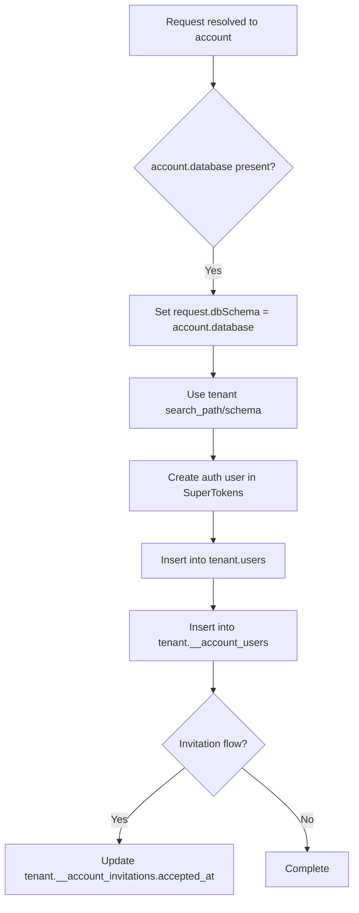
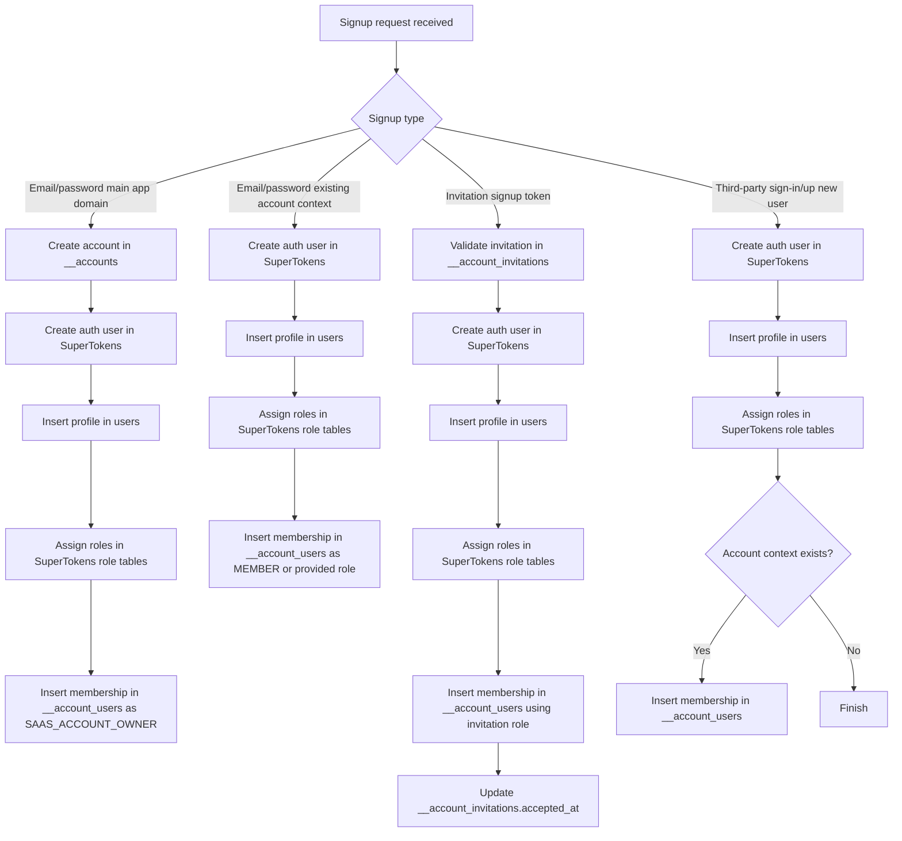

# User Creation Flow

This document explains how new users are created in this monorepo, with focus on `saas` and its dependency on `fastify/packages/user`.

Assumption used here: the app user table is named `users`.

## Components Involved

- `saas/packages/fastify`: SaaS-specific signup/account logic
- `fastify/packages/user`: base user persistence and SuperTokens integration
- SuperTokens: authentication/session/role internals

## Main Tables

### App-managed tables

- `users` (from `fastify/packages/user`)
- `__accounts` (from `saas/packages/fastify`)
- `__account_users` (from `saas/packages/fastify`)
- `__account_invitations` (from `saas/packages/fastify`)

### SuperTokens-managed tables

- Auth/session tables (internal to SuperTokens)
- Role mapping tables (for example `st__user_roles`)

## `users` Schema Location (Public vs Tenant)

- `users` is in `public` schema when account-level separate schema is not used.
- `users` is in tenant schema when `account.database` is set (for example `s_xxxxxxxx`).
- Runtime routing is done via `dbSchema` in request/user context, and tenant schema is prepared by `runAccountMigrations`.

### Tenant Schema Diagram (`account.database` is set)

## High-Level Flow Diagram

## Detailed Flows

### 1) Email/password signup from main app domain

Source path:
- `saas/packages/fastify/src/supertokens/recipes/third-party-email-password/emailPasswordSignUpPost.ts`
- `saas/packages/fastify/src/supertokens/recipes/third-party-email-password/emailPasswordSignUp.ts`

Writes:
1. `__accounts` insert (new tenant/account)
2. SuperTokens auth user creation
3. `users` insert
4. SuperTokens role assignment insert(s)
5. `__account_users` insert as `SAAS_ACCOUNT_OWNER`

Failure handling:
- If signup API result is not OK, created account is deleted.
- If `users` insert fails, SuperTokens user is deleted.

### 2) Email/password signup on existing account domain/subdomain

Source path:
- `saas/packages/fastify/src/plugins/accountDiscoveryPlugin.ts`
- `saas/packages/fastify/src/supertokens/recipes/third-party-email-password/emailPasswordSignUp.ts`

Writes:
1. SuperTokens auth user creation
2. `users` insert
3. SuperTokens role assignment insert(s)
4. `__account_users` insert (default member role unless overridden)

### 3) Invitation signup (new user)

Source path:
- `saas/packages/fastify/src/model/accountInvitations/handlers/signup.ts`

Writes:
1. SuperTokens auth user creation
2. `users` insert
3. SuperTokens role assignment insert(s)
4. `__account_users` insert using invitation role
5. `__account_invitations.accepted_at` update

### 4) Invitation join (existing logged-in user)

Source path:
- `saas/packages/fastify/src/model/accountInvitations/handlers/join.ts`

Writes:
1. `__account_users` insert
2. `__account_invitations.accepted_at` update

No new row is created in `users` in this path.

### 5) Third-party signup (new social user)

Source path:
- `saas/packages/fastify/src/supertokens/recipes/third-party-email-password/thirdPartySignInUp.ts`

For new users (`createdNewUser = true`), writes:
1. SuperTokens auth user creation
2. `users` insert
3. SuperTokens role assignment insert(s)
4. optional `__account_users` insert (if account context exists)

For existing users (`createdNewUser = false`):
- no new user rows; `users.last_login_at` is updated.

## Multi-Database Note

If an account has its own schema (`account.database`), the same logical writes happen in that schema context for:
- `users`
- `__account_users`
- `__account_invitations`

If `account.database` is not set, these writes go to `public` schema.

This is wired via request context (`dbSchema`) and account migrations in:
- `saas/packages/fastify/src/migrations/runAccountMigrations.ts`

## Quick Verification Checklist

When a brand-new user signs up for a new account, verify inserts in:
- SuperTokens auth table(s)
- `users`
- SuperTokens role mapping table(s)
- `__account_users`
- `__accounts` (main app self-signup path only)
